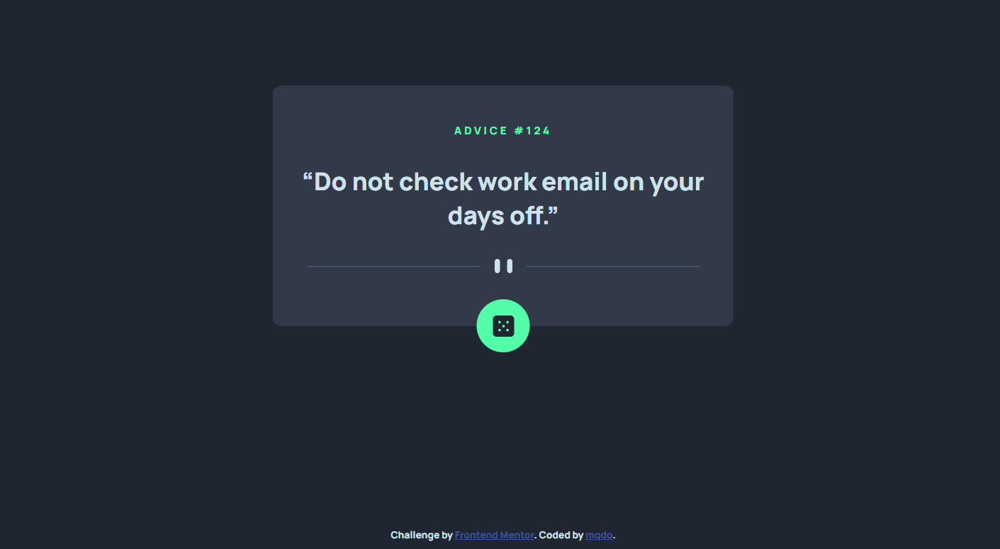

# Frontend Mentor - Advice generator app solution

This is a solution to the [Advice generator app challenge on Frontend Mentor](https://www.frontendmentor.io/challenges/advice-generator-app-QdUG-13db). Frontend Mentor challenges help you improve your coding skills by building realistic projects.

## Table of contents

- [Overview](#overview)
  - [The challenge](#the-challenge)
  - [Screenshot](#screenshot)
  - [Links](#links)
- [My process](#my-process)
  - [Built with](#built-with)
  - [What I learned](#what-i-learned)
  - [Continued development](#continued-development)
  - [Useful resources](#useful-resources)
- [Author](#author)
- [Acknowledgments](#acknowledgments)

**Note: Delete this note and update the table of contents based on what sections you keep.**

## Overview

### The challenge

Users should be able to:

- View the optimal layout for the app depending on their device's screen size
- See hover states for all interactive elements on the page
- Generate a new piece of advice by clicking the dice icon

### Screenshot

### Links

- Solution URL: [My Github](https://github.com/mqdo/advice-generator-app-main)
- Live Site URL: [Random Advice For You](https://random-advice-for-you.netlify.app/)

## My process

### Built with

- Basic HTML5
- CSS Grid
- Mobile-first workflow
- DOM events handling with JavaScript

### What I learned

After this challenge I recap what I learned with basic HTML5, CSS and JavaScript. Besides, I figured out what I need to do with a project given: what is the requirements and how to build as close as possible to the project.

### Continued development

Even though I have learned up to React.js, Next.js and Node.js,... but I will keep on practicing the basics until fluently building web applications.

### Useful resources

- [Mozilla Developer](https://developer.mozilla.org/en-US/) - This helped me for remember the use of JavaScript functions and properties.
- [W3 School](https://www.w3schools.com/) - This is an amazing article which helped me understand more about HTML and CSS, also JavaScript too.

## Author

- Website - [mqdo](https://www.mqdo.github.io)
- Frontend Mentor - [@mqdo](https://www.frontendmentor.io/profile/mqdo)

## Acknowledgments

This is where you can give a hat tip to anyone who helped you out on this project. Perhaps you worked in a team or got some inspiration from someone else's solution. This is the perfect place to give them some credit.
